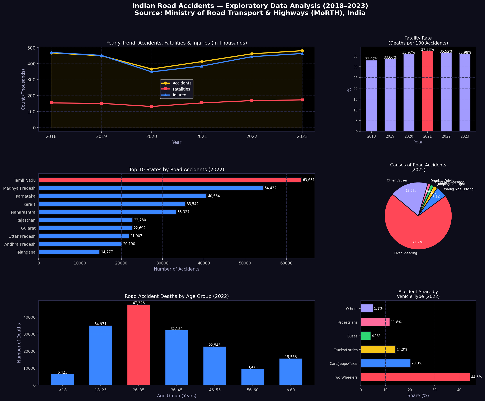

# SCT_DS_2 - Indian Road Accidents EDA

## 📌 Task Overview
**Internship:** SkillCraft Technology — Data Science Track  
**Task 02:** Perform data cleaning and exploratory data analysis (EDA) on a dataset of your choice. Explore relationships between variables and identify patterns and trends in the data.

---

## 📊 About This Project
This project performs **Data Cleaning & EDA on Indian Road Accidents data (2018–2023)** using real statistics published by the **Ministry of Road Transport & Highways (MoRTH), India**.

---

## 📁 Files
| File | Description |
|------|-------------|
| `task02_road_accidents_eda.py` | Python script for data cleaning & EDA |
| `india_road_accidents_eda.png` | Output visualization (6 charts) |

---

## 🛠️ Tools & Libraries
- Python 3
- Pandas
- NumPy
- Matplotlib

---

## 📦 How to Run
```bash
pip install pandas numpy matplotlib
python task02_road_accidents_eda.py
```

---

## 📈 Output Preview


---

## 🗂️ Data Source
**Ministry of Road Transport & Highways (MoRTH)**  
Annual Reports: Road Accidents in India (2018–2023)  
[https://morth.nic.in](https://morth.nic.in)

---

## 🔍 EDA Performed
- ✅ Data cleaning & missing value check
- ✅ Derived fatality rate & injury rate columns
- ✅ Year-on-year change analysis
- ✅ Trend analysis (2018–2023)
- ✅ State-wise accident distribution
- ✅ Cause-wise breakdown
- ✅ Age-group analysis
- ✅ Vehicle type involvement

---

## 🔑 Key Insights
- India recorded **4,80,583 road accidents** in 2023 — the highest ever
- **1,72,890 deaths** in 2023 — rising trend year after year
- **Over Speeding** is responsible for **71.2%** of all fatalities
- **Tamil Nadu** has the highest number of accidents among all states
- The **26–35 age group** is the most affected, accounting for the most deaths
- **Two-wheelers** are involved in **44.5%** of all accidents
- Accidents dropped sharply in **2020** due to COVID-19 lockdowns, then surged again

---

*Completed as part of SkillCraft Technology Data Science Internship*
